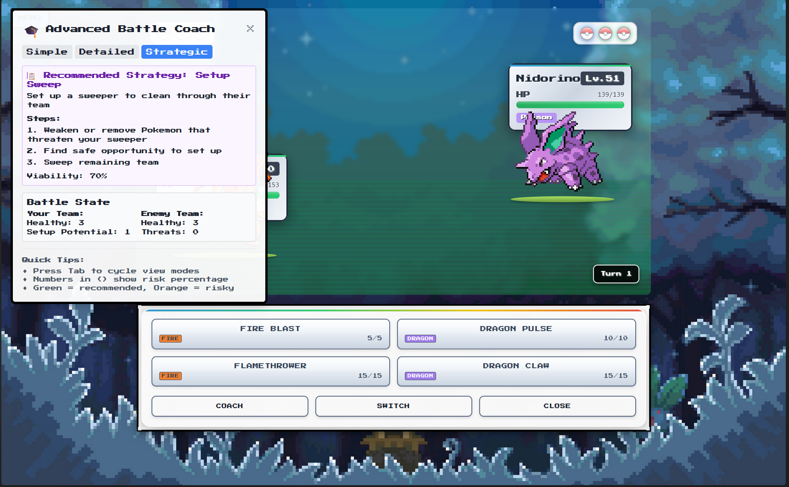

# Pokemon Battle Ultimate Arena

<div align="center">


**Transforming classic monster battles through deterministic real-time multiplayer platform**

[Getting Started](#quick-start-guide) •
[Features](#key-features) •
[Architecture](#system-architecture) •
[Documentation](#documentation) •
[Contributing](#contributing)

</div>

---

## Overview

**Pokemon Battle Ultimate Arena** is a state-of-the-art multiplayer battle platform that combines deterministic game mechanics with real-time communication technology. It delivers competitive turn-based battles through sophisticated WebSocket orchestration, providing players with strategic depth while maintaining technical excellence through containerized microservices architecture.

This platform integrates cutting-edge battle simulation, real-time multiplayer coordination, and comprehensive observability to create an engaging competitive environment. It serves as a bridge between classic battle mechanics and modern web technology standards.

**INTELLECTUAL PROPERTY NOTICE:** This application is for educational and technical demonstration purposes only. It does not redistribute copyrighted assets. All Pokémon-related intellectual property belongs to their respective owners.

## Key Features

### Real-Time Multiplayer Battle Engine

<table>
<tr>
<td width="70%">
<ul>
<li><b>Deterministic Turn Resolution</b>: Consistent battle outcomes through priority-based move ordering and transparent damage calculations</li>
<li><b>Advanced Type Effectiveness System</b>: Complete implementation of type matchups with multiplier-based damage modification</li>
<li><b>Status Effect Management</b>: Comprehensive status condition tracking including burn, poison, paralysis, freeze, and sleep mechanics</li>
<li><b>Real-time Synchronization</b>: WebSocket-based communication ensuring instantaneous battle state updates across all participants</li>
</ul>
</td>
<td width="30%">

</td>
</tr>
</table>

### Interactive Team Building System

<table>
<tr>
<td width="30%">

</td>
<td width="70%">
<ul>
<li><b>Comprehensive Roster Management</b>: Access to extensive creature database with detailed stats, movesets, and type information</li>
<li><b>Strategic Team Composition</b>: Advanced team building tools with type coverage analysis and synergy recommendations</li>
<li><b>Random Team Generation</b>: Intelligent randomization algorithms creating balanced team compositions for quick matches</li>
<li><b>Move Set Customization</b>: Complete move selection with damage calculations, priority levels, and strategic effect previews</li>
</ul>
</td>
</tr>
</table>

### Sophisticated Room Management

<table>
<tr>
<td width="70%">
<ul>
<li><b>Dynamic Room Creation</b>: Seamless multiplayer lobby system with unique room codes and participant management</li>
<li><b>Real-time Chat Integration</b>: Built-in communication system for coordination and strategic discussion</li>
<li><b>Spectator Mode Support</b>: Observer functionality allowing multiple viewers per battle session</li>
<li><b>Match State Persistence</b>: Robust battle state management with reconnection capabilities and session recovery</li>
</ul>
</td>
<td width="30%">

</td>
</tr>
</table>

### AI-Powered Strategic Advisory

<table>
<tr>
<td width="30%">

</td>
<td width="70%">
<ul>
<li><b>Intelligent Move Recommendations</b>: Advanced heuristic analysis providing optimal move suggestions based on battle state</li>
<li><b>Risk Assessment Engine</b>: Comprehensive evaluation of strategic options with probability-based outcome predictions</li>
<li><b>Matchup Analysis</b>: Deep statistical analysis of creature interactions and type effectiveness calculations</li>
<li><b>Learning Algorithm Integration</b>: Adaptive recommendation system that improves through battle pattern analysis</li>
</ul>
</td>
</tr>
</table>

### Comprehensive Monitoring & Analytics

<table>
<tr>
<td width="70%">
<ul>
<li><b>Real-time Performance Metrics</b>: Prometheus-based monitoring with custom application metrics and system health indicators</li>
<li><b>Interactive Dashboard Visualization</b>: Grafana-powered analytics displaying battle statistics, user engagement, and system performance</li>
<li><b>Health Check Automation</b>: Multi-environment validation scripts ensuring consistent deployment quality across platforms</li>
<li><b>Battle Analytics Tracking</b>: Comprehensive game state logging with pattern recognition and competitive balance analysis</li>
</ul>
</td>
<td width="30%">

</td>
</tr>
</table>

---

## Technology Stack

<table>
<tr>
<th>Layer</th>
<th>Components</th>
<th>Technologies</th>
</tr>
<tr>
<td><b>Frontend</b></td>
<td>Battle Interface, Team Builder, Room Management</td>
<td>Vanilla JavaScript, HTML5 Canvas, WebSocket API, CSS3</td>
</tr>
<tr>
<td><b>Backend</b></td>
<td>Real-time Gateway, REST API, Battle Engine</td>
<td>Node.js, Socket.IO, FastAPI, Python, Uvicorn</td>
</tr>
<tr>
<td><b>Data Layer</b></td>
<td>Persistence, Caching, Session Management</td>
<td>PostgreSQL, Redis, JSON Schema Validation</td>
</tr>
<tr>
<td><b>Infrastructure</b></td>
<td>Containerization, Orchestration, Reverse Proxy</td>
<td>Docker, Docker Compose, AWS ECS, Nginx, Supervisor</td>
</tr>
<tr>
<td><b>Observability</b></td>
<td>Metrics, Dashboards, Health Monitoring</td>
<td>Prometheus, Grafana, Custom Health Endpoints</td>
</tr>
</table>

## Project Structure

```
Pokemon-Battle-Arena/
├── api/                           # FastAPI REST service
│   ├── __init__.py                    # Package initialization
│   ├── main.py                        # FastAPI application entry
│   ├── routes/                        # API route handlers
│   │   ├── health.py                  # Health check endpoints
│   │   ├── stats.py                   # Battle statistics
│   │   └── rooms.py                   # Room metadata
│   └── models/                        # Data models
│
├── server/                        # Node.js WebSocket gateway
│   ├── server.js                      # Socket.IO server
│   ├── routes/                        # Socket event handlers
│   │   ├── battle.js                  # Battle event management
│   │   ├── rooms.js                   # Room lifecycle
│   │   └── chat.js                    # Chat functionality
│   └── utils/                         # Utility functions
│
├── components/                    # Frontend UI components
│   ├── battle/                        # Battle interface
│   │   ├── arena.js                   # Main battle arena
│   │   ├── moves.js                   # Move selection
│   │   └── status.js                  # Status display
│   ├── team/                          # Team building
│   │   ├── builder.js                 # Team composition
│   │   └── selector.js                # Pokemon selection
│   └── lobby/                         # Room management
│
├── data/                          # Game data and constants
│   ├── pokemon/                       # Pokemon datasets
│   ├── moves/                         # Move definitions
│   ├── types/                         # Type effectiveness
│   └── constants/                     # Game constants
│
├── monitoring/                    # Observability configuration
│   ├── prometheus/                    # Metrics configuration
│   ├── grafana/                       # Dashboard definitions
│   └── alerts/                        # Alert rules
│
├── deploy/                        # Deployment scripts
│   ├── docker/                        # Docker configurations
│   ├── aws/                           # AWS ECS deployment
│   ├── heroku/                        # Heroku deployment
│   └── scripts/                       # Automation scripts
│
├── static/                        # Static assets
│   ├── css/                           # Stylesheets
│   ├── images/                        # UI screenshots
│   └── fonts/                         # Typography assets
│
├── tests/                         # Test suite
│   ├── unit/                          # Unit tests
│   ├── integration/                   # Integration tests
│   └── e2e/                           # End-to-end tests
│
├── docker-compose.yml             # Multi-service orchestration
├── Dockerfile                     # Container definition
├── nginx.conf                     # Reverse proxy configuration
├── supervisord.conf               # Process supervision
└── README.md                      # This documentation
```

## Quick Start Guide

### System Requirements

<table>
<tr>
<th>Component</th>
<th>Minimum Requirements</th>
<th>Recommended Specifications</th>
</tr>
<tr>
<td>Operating System</td>
<td>Windows 10, macOS 11, Ubuntu 20.04</td>
<td>Windows 11, macOS 12+, Ubuntu 22.04+</td>
</tr>
<tr>
<td>Node.js</td>
<td>18.x</td>
<td>20.x or newer</td>
</tr>
<tr>
<td>Python</td>
<td>3.8</td>
<td>3.11 or newer</td>
</tr>
<tr>
<td>RAM</td>
<td>4 GB</td>
<td>8 GB or more</td>
</tr>
<tr>
<td>Browser</td>
<td>Chrome 90+, Firefox 88+, Safari 14+</td>
<td>Latest version of Chrome, Firefox, or Safari</td>
</tr>
</table>

### Installation Process

```bash
# 1. Clone the repository
git clone https://github.com/muhkartal/PokeCoach.git
cd PokeCoach

# 2. Launch with Docker (Recommended)
docker-compose up --build

# 3. Access the application
# Game Interface: http://localhost
# API Documentation: http://localhost:8000/docs
# Grafana Dashboard: http://localhost:3001 (admin/admin)
# Prometheus Metrics: http://localhost:9090
```

### Local Development Setup

```bash
# 1. Set up WebSocket server
cd server
npm install
npm start   # Runs on http://localhost:3000

# 2. Set up FastAPI service
cd ../api
pip install -r requirements.txt
uvicorn main:app --reload --port 8000

# 3. Serve static frontend
cd ..
python -m http.server 8080  # Serves on http://localhost:8080
```

---

## Server Configuration

---

## Demo & Screenshots

<p align="center">
  
  <br>
  <em>Real-time Battle Arena with Turn Resolution and Status Tracking</em>
</p>

<p align="center">
  
  <br>
  <em>Strategic Team Composition with Type Coverage Analysis</em>
</p>

<p align="center">
  
  <br>
  <em>Multiplayer Lobby System with Real-time Chat Integration</em>
</p>

## Game Mechanics & Features

### Battle System Implementation

<table>
<tr>
<th>Mechanic</th>
<th>Implementation</th>
<th>Technical Details</th>
</tr>
<tr>
<td><b>Type Effectiveness</b></td>
<td>Multiplier-based damage calculation</td>
<td>18 types, 324 interaction matrix, floating-point precision</td>
</tr>
<tr>
<td><b>Status Effects</b></td>
<td>Turn-based condition tracking</td>
<td>Burn, poison, paralysis, freeze, sleep with duration management</td>
</tr>
<tr>
<td><b>Stat Modifications</b></td>
<td>Stage-based multiplier system</td>
<td>±6 stages per stat, multiplicative factors (2/8 to 8/2 range)</td>
</tr>
<tr>
<td><b>Priority System</b></td>
<td>Move-based turn ordering</td>
<td>5 priority levels (-4 to +4), speed tiebreaker resolution</td>
</tr>
<tr>
<td><b>Damage Formula</b></td>
<td>Generation IV+ standard</td>
<td>Level, power, attack/defense, modifiers, type effectiveness</td>
</tr>
</table>

## Observability & Monitoring

| Component         | Endpoint / Path                 | Purpose                    |
| ----------------- | ------------------------------- | -------------------------- |
| API Health        | `/health`                       | Liveness & readiness       |
| Metrics           | `/metrics`                      | Prometheus exposition      |
| Grafana           | :3001                           | Dashboards                 |
| Validation Script | `deploy/validate-deployment.sh` | Automated multi-env checks |

---

## Validation & Health

```bash
./deploy/validate-deployment.sh docker
./deploy/validate-deployment.sh aws
./deploy/validate-deployment.sh heroku
./deploy/validate-deployment.sh all
```

Checks: service availability • socket handshake • room lifecycle • health & metrics reachability

## Contributing

1. Fork repository
2. Create feature branch (`git checkout -b feature/descriptor`)
3. Implement with tests / validation
4. Commit using conventional style (`feat: add x`)
5. Push and open Pull Request

Coding Standards: ES6 modules • (planned) linting • small reviewable units • deterministic battle logic

## Available Scripts

| Command                           | Purpose              |
| --------------------------------- | -------------------- |
| `docker-compose up --build`       | Full stack start     |
| `./scripts/setup-dev.sh`          | Local dev bootstrap  |
| `./deploy/deploy.sh`              | AWS ECS deploy       |
| `./deploy/heroku.sh`              | Heroku deploy        |
| `./deploy/validate-deployment.sh` | Multi-env validation |
| `./scripts/backup.sh`             | DB backup            |

---

## Support and Community

-  **Documentation**: [GitHub Wiki](https://github.com/muhkartal/PokeCoach/wiki)
-  **Issue Tracker**: [GitHub Issues](https://github.com/muhkartal/PokeCoach/issues)
-  **Discussion Forum**: [GitHub Discussions](https://github.com/muhkartal/PokeCoach/discussions)
-  **Developer Portal**: [API Documentation](http://localhost:8000/docs)

## License

Pokemon Battle Ultimate Arena is released under the MIT License. See the [LICENSE](LICENSE) file for complete terms.

### Intellectual Property Notice

This project is a fan-inspired technical demonstration platform. Pokémon and all related intellectual property (names, sprites, types, creatures, moves, etc.) are trademarks of their respective owners (Nintendo, Game Freak, The Pokémon Company).

**Important Disclaimers:**

-  No endorsement by or affiliation with Nintendo/The Pokémon Company is implied
-  This is a non-commercial, educational project for technical demonstration
-  No copyrighted assets are redistributed; only structured metadata for game mechanics
-  Always respect intellectual property rights and official game guidelines

---

<div align="center">

**Developed with ⚡ by [Muhammad Kartal](https://github.com/muhkartal)**

_Transforming classic battle mechanics through modern web technology_

</div>
